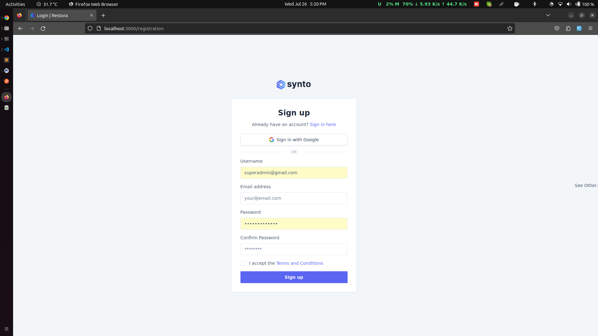
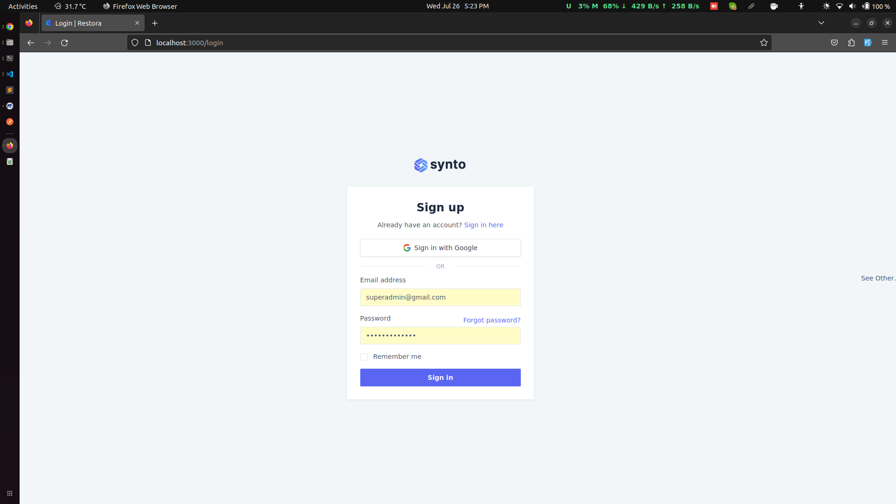
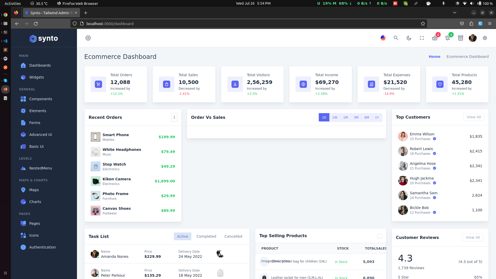

# This is the repository for my Restora projects.

### Restora is a kind of social media website where people will come and create their account. After creating a new account user can review the restaurant's environment and many things.

### Restaurant owner can also create a new account for the restaurant and update the restaurant's data to the website and promote themselves, through event's in this website.

## Database diagrams

* [Restora Database Diagram](https://dbdiagram.io/d/61fa967e85022f4ee52aa6c7)

## Technology uses for build this project

* Built with go version 1.20
* Use the [gorilla mux](https://github.com/gorilla/mux)
* Use the [gorilla session](https://github.com/gorilla/sessions)
* Use the [gorilla schema](https://github.com/gorilla/schema)
* Use the [proto buff](https://github.com/protocolbuffers/protobuf)
* Use postgreSQL

## Getting started

### Let's dive into the project and explore the features of the project.

* Registration

> User can register themselves as a user with the following options:

* Login

> User can login with the following options:

* Dashboard
> User can show the dashboard with the following data:

